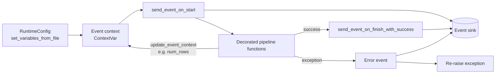
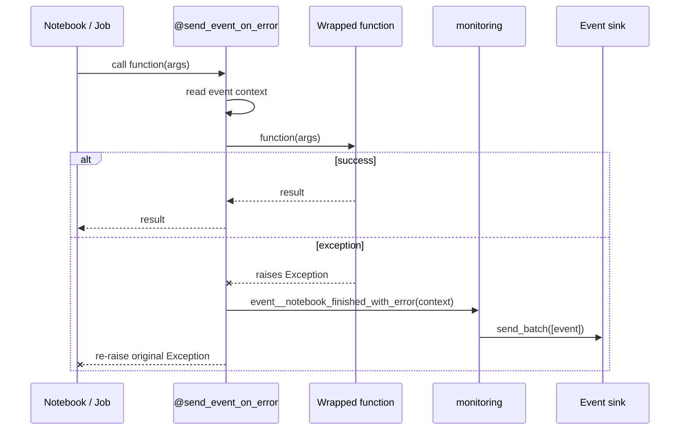
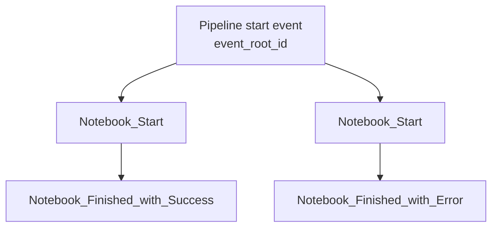

# Python Observability Decorators

Lightweight Python decorators and structured events that add observability and error handling to an existing data-pipeline codebase (Microsoft Fabric / Databricks notebooks, PySpark jobs, plain Python) **without changing the existing function bodies**.

## The problem

Pipelines grow as collections of notebooks and helper functions. When one step fails, you often only learn about it from a red cell or a late-night alert, without context about which run, which table, or which parameters were involved.

## The approach

1. A `RuntimeConfig` is initialised once per notebook/job. It creates a run-wide **event context** (IDs, table, environment, parameters).
2. Existing functions are wrapped with `@send_event_on_error(...)`. Their code stays untouched.
3. If a wrapped function raises, an error event with the full run context is sent to an event stream, and the original exception is re-raised so pipeline behaviour does not change.
4. Start and success events are sent explicitly at the beginning and end of a run. Functions can add values (e.g. `num_rows`) to the context while running.



### What happens when a decorated function fails



### Event hierarchy

Every event carries `event_id`, `event_parent_id` and `event_root_id`, so all events of one run (and of an orchestrating pipeline run, if the parent IDs are passed in) can be correlated.



Event schema (JSON):

```json
{
  "event_id": "20261005191823_453721c0-...",
  "event_parent_id": "...",
  "event_root_id": "...",
  "event_timestamp": "2026-10-05T19:18:23.177937",
  "event_type": "Notebook_Finished_with_Error",
  "event_status": "Error",
  "event_version": 1,
  "metadata": { "workspace_name": "sample-workspace", "environment": "dev", "is_debug": false },
  "payload": { "table": "orders_clean", "lakehouse": "raw", "parameters": "{...}" }
}
```

## Repository layout

| Path | Purpose |
| --- | --- |
| `observability_decorators/decorators.py` | `send_event_on_error` decorator |
| `observability_decorators/context.py` | Run-wide event context (`ContextVar`), start/success helpers, `update_event_context` |
| `observability_decorators/monitoring.py` | Event builders (`Notebook_Start`, `..._with_Success`, `..._with_Error`) |
| `observability_decorators/eventhub.py` | Event sink: Azure Event Hubs / Fabric Eventstream, or stdout if not configured |
| `observability_decorators/runtime_config.py` | `RuntimeConfig`: reads a YAML file and initialises the context |
| `observability_decorators/etl_helpers.py` | Sample PySpark helpers showing decorated functions (needs `pyspark`) |
| `examples/demo.py` | Runnable local demo, no Spark or Azure needed |

## Quick start

```bash
pip install -r requirements.txt
python examples/demo.py
```

Without configuration, events are printed to stdout as JSON. To send them to Azure Event Hubs or a Fabric Eventstream (custom endpoint), set the connection string, including `EntityPath`:

```bash
export EVENTHUB_CONNECTION_STRING="Endpoint=sb://<namespace>.servicebus.windows.net/;SharedAccessKeyName=<name>;SharedAccessKey=<key>;EntityPath=<eventhub>"
```

Keep the connection string in a secret store (e.g. Azure Key Vault) and inject it at runtime; never commit it.

## Usage

```python
from observability_decorators import (
    RuntimeConfig, send_event_on_error, send_event_on_start,
    send_event_on_finish_with_success, update_event_context,
)
from observability_decorators.context import _event_context

# 1. Initialise once (reads examples/environment.yml and sets the event context)
config = RuntimeConfig(environment_config_path="examples/environment.yml", sinks=["orders_clean"])
config.set_variables_from_file()

# 2. Wrap existing functions; the function body does not change
@send_event_on_error(_event_context)
def clean_orders(rows):
    update_event_context(num_rows=len(rows))   # optional: enrich the success event
    return [r for r in rows if r["amount"] > 0]

# 3. Emit run-level events
send_event_on_start()
clean_orders(orders)
send_event_on_finish_with_success()
```

## Adapting it

- **Different event sink:** replace `send_batch` in `eventhub.py` (e.g. Log Analytics, Kafka, a webhook). Everything else only calls `send_batch(payload=[event])`.
- **Different context fields:** adjust `set_initial_event_context` in `context.py` and the payloads in `monitoring.py`. Event functions accept `**kwargs`, so all events can be called with the same context dictionary.
- **New events or decorators:** add an `event__*` builder in `monitoring.py` and a decorator in `decorators.py` that follows the same pattern, e.g. a timing decorator or a start/success decorator per task.
- **Existing codebase:** apply the decorator to the functions you already have; for library code, wrap at import time (`func = send_event_on_error(_event_context)(func)`) so the original modules need no edits.
- **Keep the exception behaviour:** the decorator always re-raises, so orchestrators (Fabric pipelines, Databricks workflows, Azure DevOps) still see the failure.

## Notes and limitations

- The context is stored in a `ContextVar`, so it is isolated per thread/async task. Initialise it in the thread that runs your pipeline functions.
- Event and parameter payloads are serialised as JSON strings for a flat, stable schema.
- `etl_helpers.py` is illustrative; the decorators do not depend on Spark.

## License

[MIT](LICENSE) © Albert Levin
